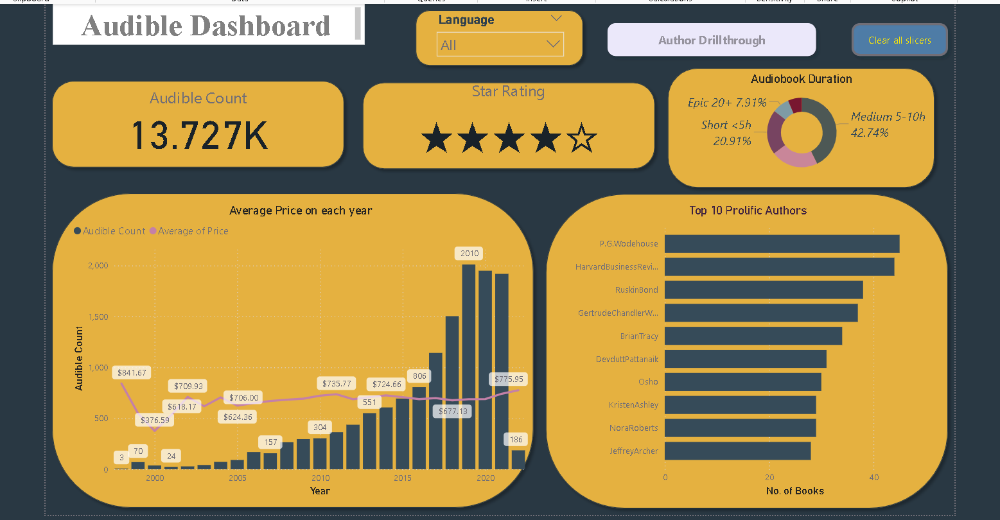
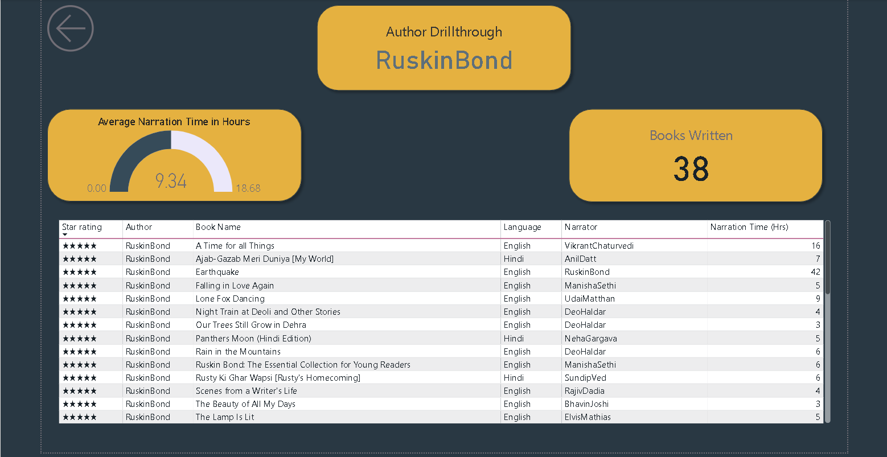

# Audible Visual Dashboard 🎧📊

## 📌 Project Overview

This project analyzes Audible dataset using Power BI. The raw dataset contained missing values, duplicates, and inconsistencies, which were cleaned to ensure accurate analysis.

## 🎯 Objectives

* Perform data cleaning and preprocessing
* Build an interactive dashboard
* Extract meaningful insights

## 🛠 Tools Used

* Power BI
* Power Query

## 🧹 Data Cleaning

* Removed duplicates
* Handled missing values
* Standardized formats
* Cleaned inconsistent entries

## 📊 Dashboard Features

* Interactive filters
* KPI visuals
* Category analysis
* Trend analysis

## 📈 Key Insights

* Certain categories dominate the dataset
* Trends show variation across different segments
* Clean data improved accuracy of insights

## 📁 File

* audible-visual-dashboard.pbix

## 🚀 How to Use

Download the file and open in Power BI Desktop.

## 📸 Screenshots

